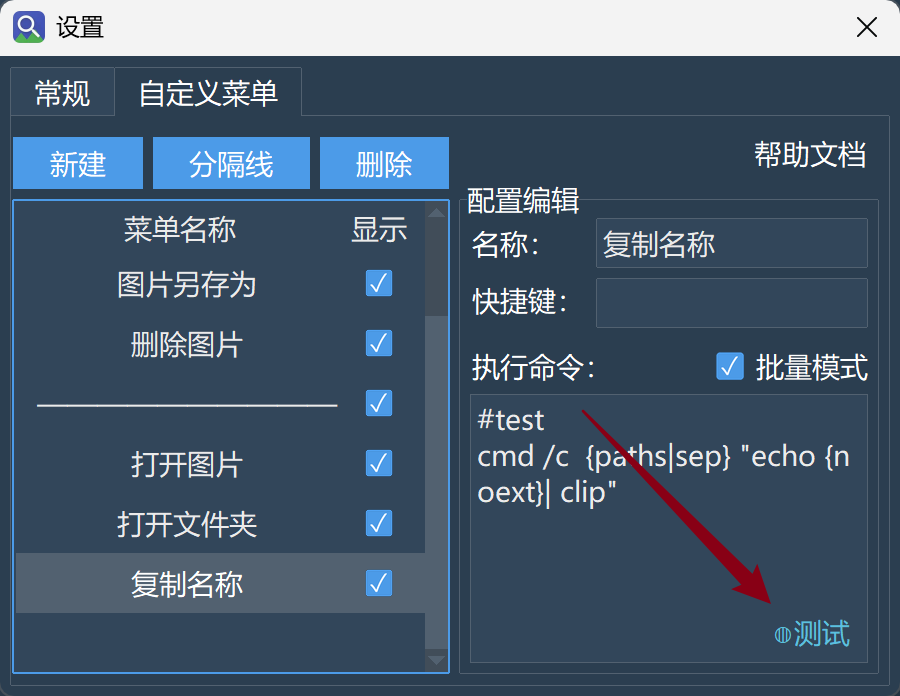

# 搜索

## 如何一次选中多张图片？

1. 间断选择：按住键盘左下角的`Ctrl`键不松手，然后用鼠标就可以选中多张不同的图片，然后执行对应的右键菜单命令了；
2. 连续选择：按住键盘左下角的`Shift`键不松手，然后鼠标点击一张图片，再随便点击另外一张图片，这样两张图片之间的所有图片都会被选中；

实际上，这正是大部分操作系统的一个默认行为的实现而已。但需要指出，选中多张图片右键打开图片或打开文件夹时，始终都只会打开选中的第一张图片和第一张图片所在的文件夹。


## 如何进行搜索过滤？

在搜索界面中，搜索框内部的最右侧有一个向下的箭头，点开它，你可以看到一系列过滤选项：

1. **相似度阈值**：任何相似度小于这个阈值的图片都不会出现在搜索结果中；
2. **文件类型**：通过文件的后缀名选中特定的文件类型。
3. **文件大小**：图片的实际存储占用，有`KB`和`MB`两种单位。
4. **所属文件夹**：根据图片所属的索引文件夹做筛选
5. **去重**：勾选后，完全相同的图片（图片内容相同且大小相同）仅保留第一张显示；


需要说明几点：

1. 搜索过滤的条件不会保存在配置文件中，因此每次重启程序，搜索过滤的条件都会**重置**。这一设计缘由在于，搜索过滤通常是临时的配置，保存在配置文件中可能误导下一次程序启动后的搜索。
2. 搜索过滤是在搜索结果全部返回后再进行的过滤。打个比方，点击右上角“...”的按钮后，选择：`返回结果数：100`，那么搜索过滤就是在这100张图片上作进一步过滤，过滤后的显示结果数自然要小于或等于100张。因此，在搜索时设置筛选条件后，如果显示`筛选条件过于严格，没有匹配到任何图像！`，那么有两条对策：
    - 点击右上角“...”的按钮，将返回的结果数拉大；
    - 长远对策：好好观察一下这些不符合条件的图像有什么特征，是否**永远不希望**搜索出它们？如果是，尝试编写**排除规则**，将它们从索引中永久排除掉；


## 如何进行多图搜索？

> **问题：**
> 我可以同时用多张图片来搜索相似图吗？粘贴几十张会不会崩？


**支持。你可以通过拖拽、粘贴，或浏览时多选（`Ctrl`/`Shift`）来同时输入多张图片进行搜索。**

**实际行为：**

- 接收到的图片列表，**第 1 张会立即执行搜索**并展示结果。  
- 后续的图片路径会暂存到内存中（只存图片路径，因此占用很小），**当你翻页浏览后续结果时，才按需执行搜索**。

**粘贴限制：**
通过粘贴输入的路径文本，超过 **3000 行**时会被截断（右下角会弹出提示），这是为了防止意外粘贴超大文本导致处理阻塞。


# 索引

## 索引容量不够了怎么办？

> **问题：**
> 我的图片非常多，会不会有一天索引“装满”了？真装满了怎么办？


**默认配置下，索引最多容纳 100 万个槽位。**
注意，这个数字是**索引内部的容量上限**，不是你实际索引的图片数（将鼠标悬停在界面上的“已索引图片数”上，可以看到容量占用情况）。

**如何修改这个上限：**
在模型选项卡中，双击正在使用的模型，打开它的配置文件（`模型文件夹名/models.json`），找到：

```json
"index_config": {
    "index_capacity": 1000000
}
```

把数字改成你需要的值，**重启程序后生效**。  
- 改大：自动生效，无需重建，索引会随图片新增逐步扩容直到新上限。  
- 改小且图片数不会持续增长：原有索引保留，搜索正常，但若后续图片增加超过新上限，更新时会报错中断。此时执行一次“重建索引”即可按新容量重新分配。

**如果你的图片量真的远超百万，有两条更根本的对策：**

| 对策                         | 做法                                                         | 好处                                           |
| ---------------------------- | ------------------------------------------------------------ | ---------------------------------------------- |
| **用排除规则减少无意义图片** | 在索引前就过滤掉表情包、缩略图、临时文件等（参见《排除规则·快速入门》） | 索引更干净，体积更小，有时还能加速扫描         |
| **分模型管理**               | 不同模型分管不同文件夹，各司其职                             | 突破单模型容量限制，也能发挥不同模型的检索特长 |

原则上，直接修改模型配置是下下策。因为HNSW索引需要将整个索引加载到内存中，索引容量的默认上限本质就是为了限制无限的内存增长。


## 自动更新索引的行为是什么？

注意，以下行为仅在2.5之后的版本：

| 阶段                            | 行为                                     | 目的                             |
| ------------------------------- | ---------------------------------------- | -------------------------------- |
| 启动后                          | 自动更新**不立即执行**，而是进入空闲监听 | 避免启动峰值时的资源竞争         |
| 系统空闲达到阈值（默认 300 秒） | 自动触发索引更新                         | 趁你离开时默默更新，不打扰工作   |
| 更新期间你回来操作电脑          | 更新**不会暂停**，继续后台运行           | 允许一次更新完整结束，避免碎片化 |
| 更新期间你主动搜索              | **自动更新被静默终止**，搜索优先         | 搜索流畅度不受影响               |
| 更新被搜索打断后                | 等下一次空闲期再度触发（不是放弃）       | 确保更新总能完成，只是推迟       |

**空闲阈值可以自定义：**
在通用设置 → 常规选项卡 → 打开配置文件，修改 `auto_update_idle_threshold`（单位：秒）。

> **手动更新与自动更新的区别：**  
> - 手动点击“更新索引目录”**立即执行**，不受空闲限制。  
> - 搜索打断时：手动更新会弹窗询问“是否终止？”给你选择权；自动更新则无提示、直接让路给搜索。


## 重建索引到底做了什么？

> **问题：**
> 点击“重建索引”是不是要重新把所有图片再扫描一遍？感觉会很久。


重建索引的行为如下（2.5之后的版本）：

```text
重建索引开始
  ├─ 清理：移除不存在、重复或已改变的向量
  ├─ 模型匹配检查：
  └─ 匹配 → 复用现有索引，只扫描新增或变化的图片（很快）
      不匹配/损坏 → 自动硬重建（全新创建，速度等同于首次索引）
```

**什么情况会导致“不匹配”而硬重建？**  

- 更换了模型本身（ONNX 文件变了）  
- 修改了 `models.json` 中的 `image_size`、`mean/std`、`preprocess_type`、`normalization`、`output_index`、`index_dim`  
- 索引文件物理损坏

**极少数情况下，你可能需要“手动硬重建”：**
如果因意外导致索引无法正常复用，可以手动删除模型文件夹下的 `name_index.json` 和 `vector_index.bin` 两个文件，然后**重启程序**，再点击“重建索引”。

> **一个重要提醒：** 
> 修改预处理参数（如 `mean/std`）后，**不要直接点“更新索引目录”**，因为“更新”不做向量一致性校验，会把新编码的向量混入旧索引，导致搜索结果失真。一定要点“重建索引”，让系统自动检测并执行硬重建。绝大多数情况下重建只是“查漏补缺”，很快；只有模型真正变化时才全量重建。


# 模型

## 怎么使用自己训练的模型？

> **问题：**
> 我想用自己微调的模型来搜索，工具支持吗？该怎么做？

**支持，但目前没有一键转换流程，需要你手动准备模型并填写配置。**
简单说就是：准备一个优化过的 **ONNX 格式模型**，放在程序模型目录下，再配好 `models.json` 文件。

**模型文件夹的组织方式：**
每个模型一个文件夹，文件夹名就是模型的唯一 ID。该文件夹下必须包含：

- 图像编码模型（`.onnx`，默认放在根目录下）
- 文本编码模型（`.onnx`，非必须，仅当是多模态模型时需要）
- `models.json` 配置文件（放在根目录）

一个模型文件夹准备好后，将其放置在：`./config/data/models/`下就可以直接被识别使用了。当然，你也可以先把模型文件夹压缩成`.zip`格式，然后在模型选项卡点击加载本地模型。


我们着重讲讲`models.json`的格式。作为直接参照，你可以在模型选项卡，双击正在使用的模型，即可看到一份标准的`models.json`是什么样的。这其中你特别需要关心的参数：

| 参数                 | 含义                                                         | 填错后果                                                     |
| -------------------- | ------------------------------------------------------------ | ------------------------------------------------------------ |
| `image_size`         | 图像预处理后的大小，如填224意味着预处理后的图像尺寸是`224 * 224` | 模型无法将预处理后的图像编码成向量，搜索直接奔溃             |
| `preprocess_type`    | 图像预处理方式（`resize` / `resize_crop` / `resize_pad`）；  | 影响输入张量，改了需要重建索引                               |
| `fill_color`         | 仅当`preprocess_type=resize_pad`时生效，以列表形式传递，例如`[255, 255, 255]` | 如果`preprocess_type=resize_pad`，改动会导致现有索引污染，必须重建 |
| `context_length`     | 文本模型的文本 tokenize 长度，仅当使用多模态模型时生效       | 对于多模态模型，这直接意味着以文搜图功能会直接报错，无法使用 |
| `mean` / `std`       | 训练时的 RGB 像素均值和标准差                                | 改动会导致现有索引污染，必须重建                             |
| `normalization`      | 是否对输出向量做 L2 归一化                                   | 填反会导致相似度得分失真、重建校验反复失败（详见下文）       |
| `output_index`       | 模型 ONNX 输出列表中第几个是图像特征向量                     | 填错会使得索引用错特征，重建时校验失败                       |
| `image_encoder_path` | 以模型文件夹为工作目录，图像编码模型（.onnx）的文件路径。可以使用绝对路径。 | 无法找到对应的图像编码模型，程序直接卡死                     |
| `text_encoder_path`  | 以模型文件夹为工作目录，文本编码模型（.onnx）的文件路径。可以使用绝对路径。 | 对于多模态模型，无法找到对应的文本编码模型，以文搜图功能无法使用 |
| `index_dim`          | 模型输出的向量维度                                           | 无法构建索引，程序直接崩溃                                   |

> ⚠️ **尤其注意 `normalization`：**  
>
> - 图像检索模型（如 CLIP 系列）输出多为**单位向量**，填 `true` 是安全选择。  
> - 纯分类网络改造的编码器通常**未归一化**，必须填 `true` 才能得到正确的余弦相似度；若填 `false` 会严重失真，且每次重建时都会被校验拦截，导致反复硬重建。  
> - 若不确定你自有模型的性质，填 `true` 几乎总是更安全。填`false`仅为免去一次**不必要的归一化**，加快索引和搜索速度；

另外，我们非常渴望用户可以尝试贡献转换后的模型。如果你成功完成了模型转换，非常欢迎你在我们的issue中贡献模型。事实上，贡献模型的核心也就是这份`models.json`文件。


## 模型下载失败怎么办

>**问题：**在模型选项卡，点击指定模型的下载按钮，结果显示下载失败了，怎么办呢？

这种情况建议手动下载。在每个模型的详情页面，都显示有一个下载链接。你可以复制这个链接到浏览器或者第三方的下载软件中进行下载。

如果因为访问不了Github无法访问对应的链接，建议寻找一下镜像网站进行下载，例如：

- [GitHub加速下载代理 - 快速访问 GitHub 文件](https://gh-proxy.com/)

手动下载好的模型后，**不需要解压**。点击模型界面的`加载本地模型`，选择对应的模型，等待数秒即可。


## 切换模型后，索引内容都“没了”？

>**问题：**下载多个模型后，在索引选项卡，点击切换模型，结果原来索引的文件夹都不见了？

这并不是“没了”了，而是：模型和索引的文件内容是一一对应的。**只要你将模型切换回去**，就可以看到原来索引的文件夹。

每当你新下载一个模型，新模型的索引文件内容总是空的，需要你为这个模型配备对应的索引文件内容。一个好的习惯是，让更擅长特定搜索任务的模型管理索引特定的文件夹，而不是一股脑全部都交给某一个模型管理。

另外，如果一个模型被删除掉了，它对应的索引也就真的“没了”。因此在删除一个模型前，请确认它索引的内容已经没有用了。


# 排除规则

## 排除规则的用途？

> **问题：**
> 我的文件夹里什么都有——照片、截图、表情包、临时缓存图、还有各种软件自动生成的缩略图。搜一张正经照片，结果冒出来一堆不相关的东西。有没有办法让这些东西干脆别出现在搜索结果里？

**解答：**
排除规则就是用来**在索引阶段就排除掉你不想搜到的图片**。它不是事后过滤，而是从根源上阻止这些文件进入搜索库——一旦被排除，它们永远不会出现在你的搜索结果中。

**和“搜索结果过滤”的区别：**

|          | 搜索结果过滤         | 排除规则                         |
| -------- | -------------------- | -------------------------------- |
| 作用阶段 | 搜索时筛掉           | 索引时就不收录                   |
| 特点     | 每次都要设置过滤条件 | 根本进不来                       |
| 适合     | 临时想排除某类结果   | 你明确知道“这类东西永远不想搜到” |

**位置：**

排除规则功能在索引选项卡，点击右下角的“排除规则管理”，在上方的编辑区中编写。点击新建规则即可开始编写。编写的规则可以通过下方选择文件夹，来预览规则的实际匹配效果。


## 如何排除一整个文件夹？

> **问题：**
> 我有个 `表情包/` 文件夹，里面几千张图，每次搜正经照片都混进来。怎么让整个文件夹都不被索引？

**直接写文件夹名就行：**

```
表情包/
```

**这条规则做了什么：** 匹配任意层级下名为 `表情包` 的文件夹，连同它里面所有图片一起排除。

**类似的常见场景：**

| 你想排除的            | 写法       | 说明                                               |
| --------------------- | ---------- | -------------------------------------------------- |
| 某个文件夹            | `缓存/`    | 只要文件夹叫“缓存”，无论在哪个子目录，都会排除     |
| 某类后缀的文件        | `*.gif`    | 所有动图不收录                                     |
| 某个具体的文件        | `temp.jpg` | 任意位置的 `temp.jpg` 都不收录                     |
| 前面加了 `/` 的文件夹 | `/人物/`   | 只排除根目录下的 `人物/`，子目录里同名的不会受影响 |


## 如何匹配特定文件名模式？

> **问题：**
> 我想排除的不只是一个固定的文件夹名，而是一类有规律的文件——比如所有 `temp_` 开头的、或者文件名里带数字编号的。怎么写？

**用通配符来描述文件名模式：**

| 你想要的效果         | 写法            | 匹配了什么                                         |
| -------------------- | --------------- | -------------------------------------------------- |
| 所有 PNG 文件        | `*.png`         | `截图.png`、`图标.png`                             |
| `temp_` 后跟一个字符 | `temp_?.jpg`    | `temp_1.jpg`、`temp_a.jpg`                         |
| Photo 或 photo 开头  | `[Pp]hoto*.jpg` | `Photo_a.jpg`、`photo_123.jpg`                     |
| 任意深度（含根目录） | **/缩略图.jpg   | 缩略图.jpg（根目录）、a/缩略图.jpg、a/b/缩略图.jpg |

**这些符号的含义：**

| 符号     | 作用                           | 一句话解释                         |
| -------- | ------------------------------ | ---------------------------------- |
| `*`      | 匹配任意多个字符（不包括 `/`） | “什么都行，只要不在子目录里”       |
| `?`      | 匹配**恰好一个**字符           | “有一个字符就行，但必须有”         |
| `[abc]`  | 匹配方括号内的任意一个字符     | “这几个里哪个都行”                 |
| `**`     | 匹配零个或多个目录层级         | “不管在哪个子目录深处，都能找到它” |
| 末尾 `/` | 只匹配目录，不匹配文件         | “我只要文件夹，不要同名文件”       |


## 排除后想保留特定内容？

> **问题：**
> 我写了 `*.png` 把所有 PNG 都排除了，但有个文件夹里的 `精选/`文件夹里的png图片我想保留。怎么办？

**用 `!` 开头写一条“重新纳入”的规则，放在排除规则的下方：**

```
*.png          ← 先把所有 PNG 排除
!精选/         ← 再把这个文件夹保留
```

**关键规则**：

1. `!` 取反规则必须写在对应排除规则的**后面**，顺序很重要。

2. `!` 取反规则**只对普通的文件名模式生效**，以下两种情况无法用 `!` 拉回：
    
    | 情况                         | 示例                         | 为什么无效                                              |
    | :--------------------------- | :--------------------------- | :------------------------------------------------------ |
    | 文件已被**特殊规则**排除     | `#max_size=1kb` + `!big.png` | 特殊规则（大小/时间）在模式匹配前就过滤了，`!` 无法抵消 |
    | 文件的扩展名**根本不是图片** | `!readme.txt`                | 索引本身只收录图片格式，非图片文件在匹配前就被忽略。    |


## 按文件大小或修改时间排除？

> **问题：**
> 我想排除那些特别大的文件（比如 50MB 的扫描件），或者排除很久以前的旧照片。文件夹和文件名没法描述这些条件，怎么办？

**用特殊规则，以 `#` 开头，后跟关键字和值：**

| 你想排除的                             | 写法                       | 效果                               |
| -------------------------------------- | -------------------------- | ---------------------------------- |
| 小于 100KB 的图（太小，一般是缩略图）  | `#min_size: 100kb`         | 排除小于 100KB 的文件              |
| 大于 10MB 的文件（太大，可能是扫描件） | `#max_size=10mb`           | 排除大于 10MB 的文件               |
| 2024 年之前的旧照片                    | `#min_modified=2024-01-01` | 排除修改时间早于 2024-01-01 的文件 |
| 某个日期之后的新增文件                 | `#max_modified=1704067200` | 排除修改时间晚于指定时间戳的文件   |

**值的格式说明：**

| 类型     | 格式                                             | 示例                               |
| -------- | ------------------------------------------------ | ---------------------------------- |
| 文件大小 | 数值 + 单位（`b`/`kb`/`mb`），不写单位默认为字节 | `500` = 500 字节，`1.5mb` = 1.5 兆 |
| 修改时间 | `YYYY-MM-DD` 日期格式，或 Unix 时间戳数字        | `2024-06-15` 或 `1718400000`       |

**关键理解：**

| 关键字         | 排除逻辑                    | 记忆方法                       |
| -------------- | --------------------------- | ------------------------------ |
| `min_size`     | 文件**小于**这个值 → 排除   | “最小都得这么大，比这小就不要” |
| `max_size`     | 文件**大于**这个值 → 排除   | “最大只能这么大，比这大就不要” |
| `min_modified` | 时间**早于**这个日期 → 排除 | “最早只能是这天，比这早就不要” |
| `max_modified` | 时间**晚于**这个日期 → 排除 | “最晚只能是这天，比这晚就不要” |

> ⚠️ **注意：** 
>
> 1. 特殊规则以 `#` 开头，但它不是注释。只有不以这些关键字开头的 `#` 行才是注释。写法不分大小写，`=` 和 `:` 都行。
> 2. **如果值写错了格式，规则会被静默忽略。** 例如 `#min_size: abc`（无法解析成数值），整条规则将不起作用，不会报错也不会当作注释。编写时请确保值格式正确，否则你可能以为规则生效了，实际上等于没写。


## 排除规则效果预览？

> **问题：**
> 我写了几条规则，但不太确定它们会不会误伤重要图片，或者漏掉想排除的文件。有没有办法在不实际重建索引的情况下，先预览一下规则的效果？

**用编辑界面下方的预览窗口。**

排除规则管理界面分为上下两部分：

| 区域     | 作用                                           |
| -------- | ---------------------------------------------- |
| **上方** | 规则编辑列表，你在这里写规则、调整顺序         |
| **下方** | 效果预览窗口，在这里看规则“如果应用了，会怎样” |

**预览窗口的使用方法：**

1. 在下方预览窗口中选择一个你电脑上的**本地文件夹**（不需要是当前索引的目录）
2. 在上方规则列表中，**单击选中某一条规则**（或什么都不选 —— 先点击新增规则，然后点击空白处即可取消所有选中。这样表示应用全部规则）
3. 预览窗口会立刻展示：在这个文件夹里，有多少张图片会被你选中的规则（或全部规则）排除

**它的设计目的：**

| 你担心的                             | 预览功能如何帮你                               |
| ------------------------------------ | ---------------------------------------------- |
| 通配符写得太宽，误伤了正常文件       | 选一个有正常图片的文件夹看看，确认无误再保存   |
| 规则没写对，根本没匹配到想排除的文件 | 选一个包含目标文件的文件夹，看预览结果是否命中 |
| 多条规则互相影响，搞不清最终效果     | 逐条预览，或看“全部规则”的汇总效果             |

> ⚠️ **重要区分：** 预览窗口只展示规则在你**手动选择的文件夹**上的模拟效果，**不会改动任何索引数据**。它纯粹是一个安全的“排练场”，让你在实际应用前确认规则是否符合预期。


## “清理排除图片”按钮的用途？

> **问题：**
> 我一开始没写排除规则，已经索引了一批乱七八糟的图片。后来补充了规则，但之前的垃圾还在库里。怎么办？

**用“清理排除图片”按钮。**这个按钮位于**索引选项卡**的右下角。

| 点击后发生了什么                                   | 目的                                                         |
| -------------------------------------------------- | ------------------------------------------------------------ |
| 根据**当前的排除规则**，重新检查所有已被索引的图片 | 找出那些现在应该被排除、但之前已经入库的文件                 |
| 把不属于任何当前索引目录的记录一并移除             | 如果你更改了索引目录设置，旧路径下的残留记录也会被清理，保持索引与当前配置一致。 |
| 把这些匹配到的图片从索引中移除                     | 让搜索结果立刻变干净                                         |
| 图片文件本身不会删除，硬盘上依然存在               | 只清理索引记录，不动你的文件                                 |

**什么时候用：**

| 场景                                 | 是否需要点这个按钮                 |
| ------------------------------------ | ---------------------------------- |
| 刚写好排除规则，之前没索引过         | 不需要，索引时自动应用             |
| 已经索引了一批图，后补了排除规则     | **需要**，把之前的漏网之鱼清掉     |
| 修改了已有的排除规则，想立刻看到效果 | **需要**，让修改对已索引的图片生效 |


# 自定义菜单命令

## 自定义菜单命令的用途？

> **问题：**
> 我已经能用这个工具搜索图片、右键打开、复制、另存为了——那“自定义菜单命令”还能让我多做些什么？

**答案：**
它让你在右键菜单里添加**你自己的命令**，对选中的图片直接调用任意外部程序或脚本，完成搜索工具本身不内置的自动化操作。

**示例：**
你搜到一批截图，想快速把它们全部转成 JPG。如果没有自定义命令，你需要一张张打开、另存为。有了它，你只需在菜单里添加一条命令，之后每次搜索出图片，选中、右键、点击，就自动完成。

**它和内置菜单的关系：**

| 内置菜单能做的                   | 自定义菜单能额外做的                                |
| -------------------------------- | --------------------------------------------------- |
| 打开图片、复制、另存为等固定操作 | 调用 ffmpeg、ImageMagick、Python 脚本等任意外部工具 |
| 功能固定，无法扩展               | 你想对图片做什么，就写什么命令                      |
| 已经够用——直到你发现“还差一步”   | 补上那一步，让工具更贴合你的工作流                  |


## 一个自定义命令由哪些部分组成？

> **问题：**
> 我决定自己加一条命令了——它到底由什么组成？我需要写什么？

**一个完整的自定义菜单命令只有三样东西：**

1. 命令执行的**主体**
2. 命令执行的**参数**
3. 需要用到的**变量**

例如：`ffmpeg -i {path} {dir}/{noext}.jpg`

这条命令中，`ffmpeg`就是命令执行的**主体**，`-i` 、`{path}`和`{dir}/{noext}.jpg`都会被当成**参数**处理。而一条命令要想能够对选中的图片执行操作，就必须用变量（它们会在执行命令时实际替换成相应的信息）


**几个入门示例：**

| 你想做的                  | 命令写法                                                     | 说明                                                      |
| ------------------------- | ------------------------------------------------------------ | --------------------------------------------------------- |
| PNG 转 JPG                | `ffmpeg -i {path} {dir}/{noext}.jpg`                         | `{path}` 是原图，`{dir}/{noext}.jpg` 是同文件夹下的新文件 |
| 用 ImageMagick 加文字水印 | `magick {path} -pointsize 36 -fill white -gravity southeast -annotate 0 "我的水印" {dir}/watermarked_{name}` | 输出文件名前缀加上 `watermarked_`，避免覆盖原图           |
| 调用自己的 Python 脚本    | `python D:/tools/my_script.py {path} {dir}/result.png`       | 脚本接收两个参数：输入路径和输出路径，在内部自由处理      |

**这些变量是什么意思？**

| 变量      | 代表什么                                                     |
| --------- | ------------------------------------------------------------ |
| `{path}`  | 选中图片的完整路径，比如 `D:\照片\2024\IMG_001.png`          |
| `{dir}`   | 图片所在的文件夹                                             |
| `{name}`  | 完整文件名，如 `IMG_001.png`                                 |
| `{noext}` | 文件名不含后缀，如 `IMG_001`                                 |
| `{ext}`   | 后缀名含点，如 `.png`                                        |
| `{count}` | 选中图片的数量，注意**常规模式**下始终为1，仅在**批量模式**下实际计数。 |

> **注意**：你不需要给 `{path}` 加引号，因为工具会自动保证路径作为一个完整参数传递。即使你习惯性地加了引号（如 `"{path}"`），它也不会造成错误，只是多余而已。


## 多图处理时，用批量模式还是常规模式？

> **问题：**
> 我经常一次性选中几十张图片进行处理。是用常规模式还是批量模式？

**答案取决于你的任务性质。** 工具提供两种模式，目的就是让你在“独立性”和“效率”之间做取舍。

| 需求                       | 推荐模式             | 好处                   |
| -------------------------- | -------------------- | ---------------------- |
| 每张图各自得到一个独立结果 | **常规模式**（默认） | 互不干扰，写法不变     |
| 需要程序一次性看到所有文件 | **批量模式**         | 只启动一次程序，效率高 |

### 常规模式（默认）

**介绍：**选中$n$张图片，命令就会被独立地执行$n$次，每次都会把命令中的变量替换成当前那一张图的信息。

**适用场景**：逐张加水印、转格式、调色、生成缩略图……一切“一张进、一张出”的操作。

**特点：**命令简单，但多图处理效率相对较低，因为$n$张图片就等于要重复开$n$次进程。


### 批量模式（需要时手动勾选开启）

**介绍：**命令只执行一次，但你需要使用 `{paths}`（注意有个 **s**）来接收所有文件的列表。

**适用场景：** 拼接长图、合并成 PDF、统计所有图片信息……需要程序“总览全局”的操作。

**快速判断法则：**

- 命令的逻辑是“一个文件 → 一个文件”：用常规模式，变量用 `{path}`
- 命令的逻辑是“一堆文件 → 一个结果”：用批量模式，变量用 `{paths}`

**批量模式下各变量的指向：**

- `{path}`、`{dir}`、`{name}`、`{noext}`、`{ext}` 均指向**第一个文件**。
- `{paths}` 才是所有文件的列表。
- `{count}` 为文件总数。

这样设计是为了保持与常规模式下变量含义的一致，避免混淆。


## 文件列表的分隔符如何指定？

> **问题：**
> 我开启了批量模式，用了 `{paths}`——但程序要求文件之间用逗号分隔，怎么办？

**用 `sep` 修饰符来控制分隔方式。** 它只适用于列表变量 `{paths}` 和 `{ask_files}`。

**语法：** `{变量:sep=分隔符}`

| 你的程序需要                   | 写法             | 实际传进去的效果                |
| ------------------------------ | ---------------- | ------------------------------- |
| 多个独立参数（默认）           | `{paths}`        | 图1 图2 图3（每个作为单独参数） |
| 逗号分隔                       | `{paths:sep=,}`  | `图1,图2,图3`（合为一个参数）   |
| 竖线分隔（FFmpeg concat 常用） | `{paths:sep=\|}` | `图1\|图2\|图3`                 |
| 换行分隔                       | `{paths:sep=\n}` | 每行一个路径                    |

> **目的：** 不同程序对文件列表的格式要求不同，`sep` 让你一条命令适配各种情况。


## 引号的分组作用

> **问题：**
> 变量路径不用加引号我知道了，但命令本身还有其他空格——比如我想传一个带空格的固定参数给程序，该怎么写？

**核心规则：**

| 你的目的                                 | 写法           | 效果                                                     |
| :--------------------------------------- | :------------- | :------------------------------------------------------- |
| 把一个含空格的固定字符串当作**一个参数** | `"固定的文本"` | 合并为一个参数 `固定的文本`，引号会被剥离                |
| 保护变量（无必要，但无害）               | `"{path}"`     | 结果与不写引号完全相同，引号只起分组作用，不会被传给程序 |
| 在参数里包含字面双引号                   | `"a\"b"`       | 变成一个参数 `a"b`（`\"` 是转义）                        |

**普通引号不会成为传给程序的数据本身。** 它的唯一作用是在分词阶段告诉解析器“这几个词应该放在一起”。如果你一定需要使用引号，请使用转义符号`\`；

**示例：**

```text
ffmpeg -i {path} -vf "drawtext=text='hello world':x=10:y=10" {dir}/out.mp4
```

这里 `"drawtext=text='hello world':x=10:y=10"` 是一整个滤镜子串，必须用双引号包住，否则空格会把它切成好几个参数。

**关于 `{path}` 到底要不要加引号：**
结论是**不需要**。因为变量值在分词完成后才注入参数数组，含空格路径会被视为一个整体。如果你加了引号，比如 `"{path}"`，引号仅执行分组后就消失了，最终传给程序的参数和没加引号时完全一样——不会有任何负面作用，但也纯属多此一举。


## 命令执行前手动输入数据

> **问题：**
> 比如每次加水印的文字不同，或者想手动选择输出文件夹——能不能在执行命令时弹出输入框让我填写？

**可以，用 `ask` 系列变量。** 命令执行到这些变量时，会弹出一个输入窗口，填完后再继续。**可用的 ask 变量：**

| 变量           | 弹出什么     | 适用场景                                                     |
| -------------- | ------------ | ------------------------------------------------------------ |
| `{ask_string}` | 文本输入框   | 水印文字、文件名前缀、备注信息                               |
| `{ask_int}`    | 整数输入框   | 宽度、高度、质量参数（如 `-q:v {ask_int}`）                  |
| `{ask_float}`  | 小数输入框   | 缩放比例、透明度等                                           |
| `{ask_dir}`    | 文件夹选择框 | 手动指定输出目录                                             |
| `{ask_file}`   | 单文件选择框 | 选择水印图、模板文件等                                       |
| `{ask_files}`  | 多文件选择框 | 额外批量选择文件，作为列表变量，可与 `sep` 修饰符配合使用，如 `{ask_files:sep=,}` |

**示例：**

```
自定义水印 → magick {path} -gravity southeast -fill white -pointsize 36 -annotate 0 "{ask_string}" {dir}/watermarked_{name}
```

执行时：

1. 弹出一个文本框
2. 你输入“张三拍摄 2024”
3. 水印文字就是“张三拍摄 2024”

> **注意：** 同一个 ask 变量在命令中出现多次，只会弹一次框。用户点取消则中止执行。


## 写好的命令怎么测试？

> **问题：**
> 命令写完了，但我不确定它会不会正常工作，甚至担心把原图弄坏了。怎么安全地测试？

**用测试模式。** 它的目的就是让你在隔离环境里验证命令，绝不触碰原图。

**启用方法：**
在编辑命令时，点击右下角的 **●正常**按钮，当按钮变成**◍测试** 的字样时，它会自动在命令第一行插入`#test`标识，进入到测试模式。这与手动写 `#test` 完全等效——按钮只是帮你省去手敲这一步。

**测试模式下会发生什么：**

| 行为                                   | 目的                                                       |
| -------------------------------------- | ---------------------------------------------------------- |
| 选中的图片被**复制**到一个临时文件夹   | 原图 100% 安全，任何操作只影响副本                         |
| 命令在临时文件夹里执行                 | 输出文件也在临时文件夹，不会污染原目录                     |
| 选中的图片超过 10 张时自动截断为 10 张 | 防止一次测试耗时过长                                       |
| 执行完成后弹出结果窗口                 | 你能看到完整的参数解析结果、返回码、程序输出，方便排查问题 |

另外，一条命令如果语法错误，比如没有使用正确的变量名，无论是正常模式还是测试模式，都会在实际执行前就被拦截。解析错误会弹框并带行号/列号（如"未闭合的引号，第1行第6列"）。


> **推荐工作流：** 先写命令 → 开启测试模式 → 选一张图和多张图验证 → 确认无误 → 关闭测试模式 → 正式使用。


## 右键菜单弹出的测试窗口怎么关闭？

正如上面所言，这是测试模式下的行为。进入到界面右上角的配置设置，进入自定义菜单，选择当前所使用的菜单，然后点击右下角的测试按钮，变成正常即可。




## 常见错误有哪些？

> **问题：**
> 我觉得自己已经理解了，但有没有一个清单，让我在写命令时快速对照一下？

**常见的错误如下：**

| 错误写法                  | 为什么不对                                     | 正确做法                          |
| ------------------------- | ---------------------------------------------- | --------------------------------- |
| 用单引号分组：`'a b'`     | 单引号不参与分组，会被拆成多个参数             | 用双引号：`"a b"`                 |
| 在命令里用 `\|` `>` `&`   | 命令不经 shell，这些符号会当作普通参数传给程序 | 需要管道时封装成脚本调用          |
| 一条命令写多行            | 一行就是一次完整的命令，多行会报错             | 多步骤逻辑封装进 .py 或 .ps1 脚本 |
| 把 `{paths}` 用在常规模式 | 常规模式下 `{paths}` 只含一个元素              | 需要列表时切到批量模式            |
| 命令使用`#`开头           | `#`开头的内容统统会被当成注释，不会被执行      | 去掉`#`                           |


## 一行命令搞不定复杂功能？

> **问题：**
> 我想做的不只是“转个格式”那么简单——可能涉及多步处理、管道操作、剪贴板交互。一行命令肯定搞不定，怎么办？

**把复杂逻辑封装成脚本，然后用自定义命令调用脚本。**

**示例：** 你想把选中图片的路径复制到剪贴板。这在命令行里直接做很麻烦，但用 Python 脚本就很简单：

**脚本 `copy_paths.py`（放在 `D:/tools/` 里）：**

```python
import sys, pyperclip
paths = sys.argv[1:]  # 接收所有路径
pyperclip.copy("\n".join(paths))
```

**自定义命令并开启批量模式：**

```
复制路径到剪贴板 → python D:/tools/copy_paths.py {paths}
```

> **原则：** 命令本身负责“调用脚本”，脚本负责“具体逻辑”。各司其职，简单可靠。


# 用户反馈

以下提供几个用户反馈的渠道，你可以在反馈渠道做的事包括：

1. 提议新功能，你应该详细解释为什么你需要这个功能，现有的操作策略是什么，希望的功能实现大概是什么样的；
2. 反馈BUG，明确解释其复现流程；
3. 对某项原有功能 / UI 的改进想法；
4. 关于功能的某些疑问，帮助文档中没有提到；

反馈渠道：

1. [Issues · Just-A-Freshman/VimgFind](https://github.com/Just-A-Freshman/VimgFind/issues)
2. [Issues · Chorgri/VimgFind - Gitee.com](https://gitee.com/Chorgri/VimgFind/issues)
3. Outlook邮箱：Chorgri@outlook.com


