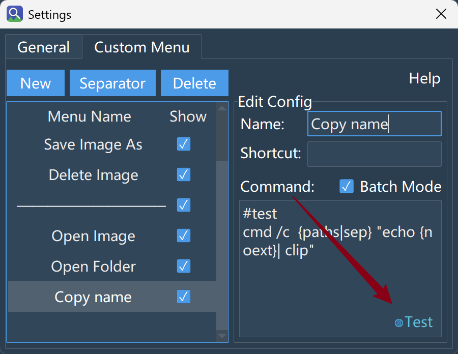

# Search
## How to select multiple images at once?
1.  **Discontinuous selection**: Hold down the `⌘` (Command) key on the bottom left of the keyboard without releasing it, then use the mouse to select multiple different images, and execute the corresponding right-click menu command. (On macOS, `Control`-click is the system right-click and cannot be used for multi-selection.)
2.  **Continuous selection**: Hold down the `Shift` key on the bottom left of the keyboard without releasing it, then click one image with the mouse, and then click another image. All images between these two images will be selected.

Actually, this is just an implementation of the default behavior of most operating systems. However, it should be noted that when selecting multiple images and right-clicking to open the image or open the folder, only the first selected image and the folder where the first image is located will always be opened.
## How to use search filters?
In the search interface, there is a downward arrow on the far right inside the search box. Click it to see a series of filtering options:
1.  **Similarity Threshold**: Any image with a similarity lower than this threshold will not appear in the search results.
2.  **File Type**: Select specific file types through the file extension.
3.  **File Size**: The actual storage occupation of the image, with two units: `KB` and `MB`.
4.  **Belonging Folder**: Filter based on the indexed folder the image belongs to.
5.  **Deduplication**: After checking, only the first one of completely identical images (same content and same size) will be displayed.

A few points to note:

1.  Search filter conditions are not saved in the configuration file, so the search filter conditions will **reset** every time the program restarts. The reason for this design is that search filtering is usually a temporary configuration, and saving it in the configuration file might mislead the search after the next program startup.
2.  Search filtering is performed after all search results are returned. For example, clicking the "..." button in the top right corner and selecting: `Number of results returned: 100`, then search filtering is a further filtering of these 100 images. The number of displayed results after filtering will naturally be less than or equal to 100. Therefore, after setting filter conditions during a search, if it displays `Filter condition too strict, no matching images found!`, there are two countermeasures:
    *   Click the "..." button in the top right corner and increase the number of returned results.
    *   Long-term countermeasure: Observe carefully what characteristics these images that do not meet the conditions have. Do you **never** want them to be searched out? If so, try writing an **Exclusion Rule** to permanently exclude them from the index.
## How to perform a multi-image search?
> **Question:**
> Can I use multiple images simultaneously to search for similar images? Will pasting dozens of images cause a crash?

**Supported. You can simultaneously input multiple images for searching by dragging, pasting, or multi-selecting (`⌘`/`Shift`) while browsing.**

**Actual Behavior:**

- For the received image list, **the 1st one will be searched immediately** and the results displayed.
- The subsequent image paths will be temporarily stored in memory (only the image paths are stored, so the occupation is very small), **and the search will be executed on demand when you browse through subsequent results by turning pages.**

**Paste Limitation:**
Path text input via pasting will be truncated if it exceeds **3000 lines** (a prompt will pop up in the bottom right corner). This is to prevent processing blockage caused by accidentally pasting ultra-large text.
# Index
## What if the index capacity is insufficient?
> **Question:**
> I have a lot of images. Will the index one day be "full"? What if it really gets full?

**Under default configuration, the index holds a maximum of 1 million slots.**
Note that this number is the **internal capacity limit of the index**, not the actual number of images you have indexed (hover your mouse over "Number of indexed images" in the interface to see capacity usage).

**How to modify this limit:**
In the Model tab, double-click the model currently in use to open its configuration file (`ModelFolderName/models.json`), find:

```json
"index_config": {
    "index_capacity": 1000000
}
```
Change the number to the value you need. **It takes effect after restarting the program.**
- **Increasing**: Takes effect automatically, no rebuild required. The index will gradually expand during image addition until the new limit is reached.
- **Decreasing (and image count won't grow continuously)**: The original index is retained, and search works normally. However, if subsequent images increase beyond the new limit, an error will be reported during updates. In this case, perform a "Rebuild Index" to reallocate according to the new capacity.

**If your image volume really far exceeds a million, there are two more fundamental countermeasures:**
| Countermeasure                                               | Method                                                       | Benefit                                                      |
| :----------------------------------------------------------- | :----------------------------------------------------------- | :----------------------------------------------------------- |
| **Use exclusion rules to reduce meaningless images**         | Filter out memes, thumbnails, temporary files, etc., before indexing (see "Exclusion Rules · Quick Start") | Cleaner index, smaller size, and sometimes faster scanning   |
| **Multi-model management**                                   | Different models manage different folders, each performing its own duty | Breaks the single-model capacity limit and leverages the retrieval strengths of different models |

In principle, directly modifying the model configuration is a last resort. Because the HNSW index needs to load the entire index into memory, the default upper limit of index capacity is essentially to limit unlimited memory growth.
## What is the behavior of automatic index updating?
Note: The following behaviors apply to versions after 2.5:

| Stage                                                        | Behavior                                                     | Purpose                                                      |
| :----------------------------------------------------------- | :----------------------------------------------------------- | :----------------------------------------------------------- |
| After startup                                                | Auto-update **does not execute immediately**, but enters idle listening | Avoid resource competition during startup peak               |
| System idle reaches threshold (default 300 seconds)          | Automatically triggers index update                          | Updates silently while you are away, not disturbing work     |
| You operate the computer during the update                   | Update **will not pause**, continues running in the background | Allows an update to finish completely, avoiding fragmentation |
| You actively search during the update                        | **Auto-update is silently terminated**, search takes priority | Search fluency is not affected                               |
| After update is interrupted by search                        | Waits for the next idle period to trigger again (not abandoned) | Ensures the update always completes, just postponed          |

**Idle threshold can be customized:**
In General Settings → Regular Tab → Open configuration file, modify `auto_update_idle_threshold` (unit: seconds).

> **Difference between Manual Update and Auto Update:**
> - Manually clicking "Update Index Directory" **executes immediately**, unaffected by idle status.
> - When search interrupts: Manual update will pop up a window asking "Terminate?" giving you a choice; Auto update has no prompt and directly yields to the search.
## What does "Rebuild Index" actually do?
> **Question:**
> Does clicking "Rebuild Index" mean scanning all images again? It feels like it will take a long time.

The behavior of Rebuild Index is as follows (versions after 2.5):

```text
Rebuild Index Start
├─ Cleanup: Remove non-existent, duplicate, or changed vectors
└─ Model Matching Check:
   └─ Match → Reuse existing index, only scan new or changed images (very fast)
   └─ Mismatch/Corrupt → Automatic hard rebuild (brand new creation, speed equivalent to first index)
```
**What causes "Mismatch" and triggers a hard rebuild?**
- The model itself was changed (ONNX file changed).
- Modified `image_size`, `mean/std`, `preprocess_type`, `normalization`, `output_index`, `index_dim` in `models.json`.
- Index file physically damaged.

**In very rare cases, you may need a "Manual Hard Rebuild":**
If the index cannot be reused normally due to an accident, you can manually delete the `name_index.json` and `vector_index.bin` files under the model folder, then **restart the program**, and then click "Rebuild Index".

> **An important reminder:**
> After modifying preprocessing parameters (like `mean/std`), **do not directly click "Update Index Directory"**, because "Update" does not do vector consistency verification and will mix newly encoded vectors into the old index, causing distorted search results. You must click "Rebuild Index" to let the system automatically detect and execute a hard rebuild. In the vast majority of cases, rebuilding is just "filling gaps", which is very fast; only when the model truly changes is a full rebuild required.
# Model
## How to use my own trained model?
> **Question:**
> I want to use my own fine-tuned model for searching. Does the tool support this? How should I do it?

**Supported, but currently there is no one-click conversion process. You need to manually prepare the model and fill in the configuration.**
Simply put: Prepare an optimized **ONNX format model**, place it under the program model directory, and configure the `models.json` file.

**Model folder organization:**
One folder per model, the folder name is the unique ID of the model. The folder must contain:
- Image encoding model (`.onnx`, default in the root directory)
- Text encoding model (`.onnx`, not required, only needed for multimodal models)
- `models.json` configuration file (placed in the root directory)

Once a model folder is prepared, place it in: `~/Library/Application Support/VimgFind/models/` and it can be directly recognized and used. Alternatively, you can compress the model folder into a `.zip` format first, and then click "Load Local Model" in the Model tab.

We will focus on the format of `models.json`. As a direct reference, you can double-click the currently used model in the Model tab to see what a standard `models.json` looks like. Among these, the parameters you particularly need to care about:
| Parameter            | Meaning                                                      | Consequence of filling wrong                                 |
| :------------------- | :----------------------------------------------------------- | :----------------------------------------------------------- |
| `image_size`         | Size of the image after preprocessing. E.g., filling 224 means the preprocessed image size is `224 * 224` | The model cannot encode the preprocessed image into a vector, search crashes directly |
| `preprocess_type`    | Image preprocessing method (`resize` / `resize_crop` / `resize_pad`) | Affects input tensor; changing this requires rebuilding the index |
| `fill_color`         | Only effective when `preprocess_type=resize_pad`, passed as a list, e.g., `[255, 255, 255]` | If `preprocess_type=resize_pad`, changing this will pollute the existing index, must rebuild |
| `context_length`     | Text tokenize length for the text model, only effective for multimodal models | For multimodal models, this means text-to-image search will error out and be unusable |
| `mean` / `std`       | RGB pixel mean and standard deviation during training        | Changing this will pollute the existing index, must rebuild  |
| `normalization`      | Whether to L2 normalize the output vector                    | Filling it backwards will cause similarity score distortion and repeated rebuild verification failures (see below) |
| `output_index`       | Which output in the model ONNX output list is the image feature vector | Filling wrong will use the wrong features for indexing, rebuild verification fails |
| `image_encoder_path` | File path of the image encoding model (.onnx) with the model folder as the working directory. Can use absolute path. | Cannot find the corresponding image encoding model, program freezes directly |
| `text_encoder_path`  | File path of the text encoding model (.onnx) with the model folder as the working directory. Can use absolute path. | For multimodal models, cannot find the corresponding text encoding model, text-to-image search unusable |
| `index_dim`          | Dimension of the vector output by the model                  | Cannot build index, program crashes directly                 |
> ⚠️ **Especially note `normalization`:**
>
> - Image retrieval models (like CLIP series) mostly output **unit vectors**, filling `true` is the safe choice.
> - Encoders transformed from pure classification networks are usually **unnormalized**, you must fill `true` to get the correct cosine similarity; if filled as `false`, it will be severely distorted, and will be intercepted by verification during every rebuild, causing repeated hard rebuilds.
> - If you are unsure about the nature of your own model, filling `true` is almost always safer. Filling `false` is only to save an **unnecessary normalization**, speeding up indexing and searching.

Also, we highly desire users to try contributing converted models. If you successfully complete a model conversion, you are very welcome to contribute the model in our issues. In fact, the core of contributing a model is this `models.json` file.
## What if the model download fails?
> **Question:** In the Model tab, I clicked the download button for a specific model, but the result showed download failed. What should I do?

In this case, manual download is recommended. On the details page of each model, a download link is displayed. You can copy this link to a browser or third-party download software for downloading.

If you cannot access the corresponding link because you cannot access Github, it is recommended to look for mirror sites for downloading, such as:

- [GitHub Accelerated Download Proxy - Fast Access to GitHub Files](https://gh-proxy.com/)

After manually downloading the model, **no need to unzip**. Click `Load Local Model` in the model interface, select the corresponding model, and wait a few seconds.

> ⚠️ **macOS note (Safari auto-unzip):**
> Safari automatically unzips archives containing only a single file/folder after download, leaving a bare `model.onnx` file or folder — the model ID (folder name) is lost, and the model can no longer be imported via `Load Local Model`.
> Solutions (pick any):
> - Prefer **in-app download** (the download button on the Model tab); the app manages the zip itself and bypasses the browser;
> - Disable Safari's auto-open: Safari → Settings → General → uncheck “Open ‘safe’ files after downloading”;
> - Use Chrome or another download tool instead (they do not auto-unzip by default).
> When importing, always select the **.zip archive**, not the extracted files.
## After switching models, the index content is "gone"?
> **Question:** After downloading multiple models, in the Index tab, I clicked to switch models, and the originally indexed folders are gone?

This is not "gone", but rather: the model and the index file content correspond one-to-one. **As long as you switch the model back**, you can see the originally indexed folders.

Every time you download a new model, the index file content for the new model is always empty, and you need to equip the corresponding index file content for this model. A good habit is to let models that are better at specific search tasks manage specific folders, rather than dumping everything onto one model.

Also, if a model is deleted, its corresponding index is truly "gone". Therefore, before deleting a model, please confirm that the content it indexes is no longer useful.
# Exclusion Rules
## What is the use of Exclusion Rules?
> **Question:**
> My folder has everything—photos, screenshots, memes, temporary cache images, and various thumbnails automatically generated by software. I search for a serious photo, and a bunch of unrelated stuff pops up. Is there a way to make these things simply not appear in the search results?

**Answer:**
Exclusion rules are used to **exclude images you don't want to search for right at the indexing stage**. It is not a post-filter; it stops these files from entering the search library at the source—once excluded, they will never appear in your search results.

**Difference from "Search Result Filtering":**
|                                                              | Search Result Filtering                     | Exclusion Rules                                              |
| :----------------------------------------------------------- | :------------------------------------------ | :----------------------------------------------------------- |
| **Action Stage**                                             | Filtered during search                      | Not indexed at the indexing stage                            |
| **Characteristics**                                          | Need to set filter conditions every time    | Simply don't get in                                          |
| **Suitable for**                                             | Temporarily want to exclude certain results | You clearly know "I never want to search for this type of thing" |

**Location:**

The Exclusion Rules function is in the Index tab. Click "Exclusion Rule Management" in the bottom right corner, and write in the editing area above. Click "New Rule" to start writing. The written rules can be previewed for their actual matching effect by selecting a folder below.
## How to exclude an entire folder?
> **Question:**
> I have a `Memes/` folder with thousands of images. Every time I search for serious photos, they get mixed in. How can I make the entire folder not indexed?

**Just write the folder name directly:**
```
Memes/
```
**What this rule does:**
Matches a folder named `Memes` at any level, excluding all images inside it along with the folder.
**Similar common scenarios:**

| What you want to exclude           | How to write it | Explanation                                                  |
| :--------------------------------- | :-------------- | :----------------------------------------------------------- |
| A certain folder                   | `Cache/`        | As long as the folder is named "Cache", it will be excluded regardless of which subdirectory it is in |
| Certain suffix files               | `*.gif`         | All gifs are not indexed                                     |
| A specific file                    | `temp.jpg`      | `temp.jpg` at any location is not indexed                    |
| Folder with `/` added at the front | `/People/`      | Only excludes `People/` in the root directory; subdirectories with the same name will not be affected |
## How to match specific file name patterns?
> **Question:**
> What I want to exclude is not just a fixed folder name, but a category of files with patterns—for example, all those starting with `temp_`, or file names containing number sequences. How to write this?

**Use wildcards to describe file name patterns:**

| The effect you want               | How to write it                                      | What it matched                                              |
| :-------------------------------- | :--------------------------------------------------- | :----------------------------------------------------------- |
| All PNG files                     | `*.png`                                              | `Screenshot.png`, `Icon.png`                                 |
| `temp_` followed by one character | `temp_?.jpg`                                         | `temp_1.jpg`, `temp_a.jpg`                                   |
| Starts with Photo or photo        | `[Pp]hoto*.jpg`                                      | `Photo_a.jpg`, `photo_123.jpg`                               |
| Any depth (including root)        | `**/thumbnail.jpg`                                   | `thumbnail.jpg` (root), `a/thumbnail.jpg`, `a/b/thumbnail.jpg` |

**Meaning of these symbols:**

| Symbol                            | Function                                             | One-sentence explanation                                     |
| :---                              | :---                                                 | :---                                                         |
| `*`                               | Matches any number of characters (not including `/`) | "Anything is fine, as long as it's not in a subdirectory"    |
| `?`                               | Matches **exactly one** character                    | "One character is fine, but there must be one"               |
| `[abc]`                           | Matches any one character in the brackets            | "Any of these is fine"                                       |
| `**`                              | Matches zero or more directory levels                | "No matter how deep in which subdirectory, it can find it"   |
| Trailing `/`                      | Matches only directories, not files                  | "I only want folders, not files with the same name"          |
## Want to keep specific content after excluding?
> **Question:**
> I wrote `*.png` to exclude all PNGs, but I want to keep the png images in the `Selected/` folder. What should I do?

**Write a "re-include" rule starting with `!` and place it below the exclusion rule:**
```
*.png ← First exclude all PNGs
!Selected/ ← Then keep this folder
```
**Key rules:**

1. The `!` negation rule must be written **after** the corresponding exclusion rule. Order is important.

2. The `!` negation rule **only works for normal file name patterns**. The following two situations cannot be pulled back using `!`:

    | Situation                                     | Example                      | Why invalid                                                  |
    | :-------------------------------------------- | :--------------------------- | :----------------------------------------------------------- |
    | File has been excluded by **Special Rule**    | `#max_size=1kb` + `!big.png` | Special rules (size/time) filter before pattern matching, `!` cannot cancel |
    | The file extension **is not an image at all** | `!readme.txt`                | The index only collects image formats; non-image files are ignored before matching |
## Exclude by file size or modification time?
> **Question:**
> I want to exclude those particularly large files (like 50MB scans), or old photos from a long time ago. Folder and file names can't describe these conditions. What to do?

**Use special rules, starting with `#`, followed by keywords and values:**

| What you want to exclude                                  | How to write it                                              | Effect                                                       |
| :-------------------------------------------------------- | :----------------------------------------------------------- | :----------------------------------------------------------- |
| Images smaller than 100KB (too small, usually thumbnails) | `#min_size: 100kb`                                           | Exclude files smaller than 100KB                             |
| Files larger than 10MB (too large, might be scans)        | `#max_size=10mb`                                             | Exclude files larger than 10MB                               |
| Old photos before 2024                                    | `#min_modified=2024-01-01`                                   | Exclude files modified earlier than 2024-01-01               |
| New files added after a certain date                      | `#max_modified=1704067200`                                   | Exclude files modified later than the specified timestamp    |

**Value format description:**

| Type                                                      | Format                                                       | Example                                                      |
| :---                                                      | :---                                                         | :---                                                         |
| File Size                                                 | Number + Unit (`b`/`kb`/`mb`), default is bytes if unit is not written | `500` = 500 bytes, `1.5mb` = 1.5 megabytes                   |
| Modification Time                                         | `YYYY-MM-DD` date format, or Unix timestamp number           | `2024-06-15` or `1718400000`                                 |

**Key Understanding:**

| Keyword                                                   | Exclusion Logic                                              | Memory Method                                                |
| :---                                                      | :---                                                         | :---                                                         |
| `min_size`                                                | File is **smaller than** this value → Exclude                | "Minimum must be this big, smaller than this is unwanted"    |
| `max_size`                                                | File is **larger than** this value → Exclude                 | "Maximum can only be this big, larger than this is unwanted" |
| `min_modified`                                            | Time is **earlier than** this date → Exclude                 | "Earliest can only be this day, earlier than this is unwanted" |
| `max_modified`                                            | Time is **later than** this date → Exclude                   | "Latest can only be this day, later than this is unwanted"   |

> ⚠️ **Note:**
>
> 1. Special rules start with `#`, but it is not a comment. Only lines starting with `#` that are not these keywords are comments. Writing is case-insensitive, both `=` and `:` work.
> 2. **If the value format is written incorrectly, the rule will be silently ignored.** For example, `#min_size: abc` (cannot be parsed into a number), the entire rule will not work, no error will be reported, and it won't be treated as a comment. Please ensure the value format is correct when writing, otherwise you might think the rule is effective, but actually it's like writing nothing.
## Exclusion rule effect preview?
> **Question:**
> I wrote a few rules but I'm not sure if they will accidentally injure important images, or miss files I wanted to exclude. Is there a way to preview the effect of the rules without actually rebuilding the index?

**Use the preview window at the bottom of the editing interface.**

The Exclusion Rule Management interface is divided into two parts:

| Area                               | Function                                                     |
| :--------------------------------- | :----------------------------------------------------------- |
| **Top**                            | Rule editing list, you write rules and adjust order here     |
| **Bottom**                         | Effect preview window, see "what would happen if applied" here |

**How to use the preview window:**


1. Select a **local folder** on your computer in the preview window below (does not need to be the currently indexed directory).
2. In the rule list above, **click to select a specific rule** (or select nothing — click "New Rule" first, then click on empty space to cancel all selections. This represents applying all rules).
3. The preview window will immediately show: in this folder, how many images will be excluded by the rule(s) you selected (or all rules).

**Its design purpose:**

| Your worry                                                   | How preview function helps you                               |
| :----------------------------------------------------------- | :----------------------------------------------------------- |
| Wildcards written too broadly, accidentally injuring normal files | Select a folder with normal images to check, confirm no error before saving |
| Rule written incorrectly, didn't match the files to be excluded at all | Select a folder containing target files, see if preview results hit |
| Multiple rules affecting each other, unclear on final effect | Preview one by one, or look at the summary effect of "All Rules" |
> ⚠️ **Important distinction:**
> The preview window only shows the simulated effect of the rules on the **folder you manually selected**, and **will not modify any index data**. It is purely a safe "rehearsal ground" for you to confirm if the rules meet expectations before actual application.
## What is the "Clean Excluded Images" button for?
> **Question:**
> I didn't write exclusion rules at the beginning, and already indexed a batch of messy images. Later I added rules, but the previous garbage is still in the library. What to do?

**Use the "Clean Excluded Images" button.** This button is located at the **bottom right of the Index tab**.

| What happens after clicking                                  | Purpose                                                      |
| :----------------------------------------------------------- | :----------------------------------------------------------- |
| Re-checks all indexed images based on **current exclusion rules** | Finds those files that should now be excluded but were previously indexed |
| Removes records that do not belong to any current index directory | If you changed index directory settings, residual records under old paths will also be cleaned, keeping the index consistent with current configuration |
| Removes these matched images from the index                  | Makes search results clean immediately                       |
| The image files themselves are not deleted, they still exist on the hard drive | Only cleans index records, does not touch your files         |

**When to use:**

| Scenario                                                     | Need to click this button?                                   |
| :---                                                         | :---                                                         |
| Just wrote exclusion rules, never indexed before             | Not needed, applied automatically during indexing            |
| Already indexed a batch of images, added exclusion rules later | **Needed**, to clear the fish that slipped through the net before |
| Modified existing exclusion rules, want to see effect immediately | **Needed**, to make modifications take effect on indexed images |

# Custom Menu Commands
## What is the use of Custom Menu Commands?
> **Question:**
> I can already use this tool to search images, right-click to open, copy, save as—so what else can "Custom Menu Commands" let me do?


**Answer:**
It lets you add **your own commands** to the right-click menu to directly call any external program or script on the selected images, completing automation operations not built into the search tool itself.

**Example:**
You searched for a batch of screenshots and want to quickly convert them all to JPG. Without custom commands, you would need to open and save each one individually. With it, you just add a command to the menu, and then every time you search for images, select, right-click, click, and it's done automatically.

**Its relationship with built-in menus:**

| What built-in menus can do                       | What custom menus can do extra                               |
| :----------------------------------------------- | :----------------------------------------------------------- |
| Fixed operations like open image, copy, save as  | Call any external tool like ffmpeg, ImageMagick, Python scripts |
| Fixed functionality, cannot extend               | Write whatever command you want to execute on the image      |
| Already enough—until you find "one step missing" | Fill that step, making the tool fit your workflow better     |

## What does a custom command consist of?
> **Question:**
> I decided to add a command myself—what exactly is it made of? What do I need to write?

**A complete custom menu command only has three parts:**

1. The **subject** executing the command
2. The **arguments** for the command execution
3. The **variables** needed

For example: `ffmpeg -i {path} {dir}/{noext}.jpg`

In this command, `ffmpeg` is the **subject** executing the command. `-i`, `{path}`, and `{dir}/{noext}.jpg` are all treated as **arguments**. And for a command to be able to perform an operation on selected images, it must use variables (they will be actually replaced with corresponding information during command execution).

**A few introductory examples:**

| What you want to do                 | Command writing                                              | Explanation                                                  |
| :---------------------------------- | :----------------------------------------------------------- | :----------------------------------------------------------- |
| PNG to JPG                          | `ffmpeg -i {path} {dir}/{noext}.jpg`                         | `{path}` is the original image, `{dir}/{noext}.jpg` is the new file in the same folder |
| Add text watermark with ImageMagick | `magick {path} -pointsize 36 -fill white -gravity southeast -annotate 0 "My Watermark" {dir}/watermarked_{name}` | Add `watermarked_` prefix to output filename to avoid overwriting original |
| Call your own Python script         | `python ~/tools/my_script.py {path} {dir}/result.png`       | Script receives two arguments: input path and output path, handles freely internally |

**What do these variables mean?**

| Variable                            | What it represents                                           |
| :---                                | :---                                                         |
| `{path}`                            | Full path of the selected image, e.g., `/Users/name/Photos/2024/IMG_001.png` |
| `{dir}`                             | The folder where the image is located                        |
| `{name}`                            | Complete filename, e.g., `IMG_001.png`                       |
| `{noext}`                           | Filename without extension, e.g., `IMG_001`                  |
| `{ext}`                             | Extension with dot, e.g., `.png`                             |
| `{count}`                           | Number of selected images. Note: in **Normal Mode** it is always 1, only actually counts in **Batch Mode**. |

> **Note**: You don't need to add quotes to `{path}`, because the tool automatically guarantees the path is passed as a complete argument. Even if you habitually add quotes (like `"{path}"`), it won't cause an error, it's just redundant.
## For multi-image processing, use Batch Mode or Normal Mode?
> **Question:**
> I often select dozens of images at once for processing. Should I use Normal Mode or Batch Mode?

**The answer depends on the nature of your task.** The tool offers two modes, the purpose is to let you choose between "independence" and "efficiency".

| Need                                   | Recommended Mode          | Benefit                                   |
| :------------------------------------- | :------------------------ | :---------------------------------------- |
| Each image gets an independent result  | **Normal Mode** (Default) | No mutual interference, writing unchanged |
| Program needs to see all files at once | **Batch Mode**            | Start program only once, high efficiency  |
### Normal Mode (Default)
**Introduction:** Select $n$ images, the command is executed independently $n$ times. Each time, variables in the command are replaced with info of that specific image.
**Suitable for:** Adding watermarks one by one, converting formats, color grading, generating thumbnails... any "one in, one out" operation.
**Characteristics:** Command is simple, but multi-image processing efficiency is relatively low because $n$ images means opening the process $n$ times repeatedly.
### Batch Mode (Manually check to enable when needed)
**Introduction:** Command executes only once, but you need to use `{paths}` (note the **s**) to receive the list of all files.
**Suitable for:** Stitching long images, merging into PDF, counting all image info... operations where the program needs a "global overview".
**Quick Judgment Rule:**
- Command logic is "one file → one file": Use Normal Mode, variable is `{path}`
- Command logic is "a pile of files → one result": Use Batch Mode, variable is `{paths}`

**Variable pointing in Batch Mode:**
- `{path}`, `{dir}`, `{name}`, `{noext}`, `{ext}` all point to the **first file**.
- `{paths}` is the list of all files.
- `{count}` is the total number of files.

This design is to maintain consistency with variable meanings in Normal Mode and avoid confusion.
## How to specify the separator for the file list?
> **Question:**
> I enabled Batch Mode and used `{paths}`—but the program requires files to be separated by commas. What to do?

**Use the `sep` modifier to control the separation method.** It only applies to list variables `{paths}` and `{ask_files}`.

**Syntax:** `{variable:sep=separator}`

| What your program needs                   | Writing          | Actual effect passed in                             |
| :---------------------------------------- | :--------------- | :-------------------------------------------------- |
| Multiple independent arguments (Default)  | `{paths}`        | Image1 Image2 Image3 (each as a separate argument)  |
| Comma separated                           | `{paths:sep=,}`  | `Image1,Image2,Image3` (combined into one argument) |
| Pipe separated (Common for FFmpeg concat) | `{paths:sep=\|}` | `Image1\|Image2\|Image3`                            |
| Newline separated                         | `{paths:sep=\n}` | One path per line                                   |
> **Purpose:** Different programs have different format requirements for file lists. `sep` lets you adapt one command to various situations.
## The grouping role of quotes
> **Question:**
> I know variable paths don't need quotes, but the command itself has other spaces—for example, I want to pass a fixed argument with spaces to the program. How to write?

**Core Rule:**

| Your purpose                                                 | Writing        | Effect                                                       |
| :----------------------------------------------------------- | :------------- | :----------------------------------------------------------- |
| Treat a fixed string containing spaces as **one argument**   | `"fixed text"` | Merged into one argument `fixed text`, quotes are stripped   |
| Protect variables (unnecessary, but harmless)                | `"{path}"`     | Result is exactly the same as not writing quotes. Quotes only group, are not passed to the program |
| Include literal double quotes in the argument                | `"a\"b"`       | Becomes one argument `a"b` (`\"` is escape)                  |

**Regular quotes do not become part of the data passed to the program.** Their only role is to tell the parser during the tokenization stage "these words should be together". If you absolutely must use quotes, use the escape symbol `\`.

**Example:**

```text
ffmpeg -i {path} -vf "drawtext=text='hello world':x=10:y=10" {dir}/out.mp4
```
Here `"drawtext=text='hello world':x=10:y=10"` is a whole filter substring. It must be wrapped in double quotes, otherwise spaces would cut it into several arguments.
**About whether `{path}` needs quotes:**
The conclusion is **no need**. Because variable values are injected into the argument array after tokenization is complete. Paths containing spaces are treated as a whole. If you add quotes, like `"{path}"`, the quotes disappear after just grouping. The final parameter passed to the program is exactly the same as without quotes—no negative effect, but purely redundant.
## Manually input data before command execution
> **Question:**
> For example, the text for a watermark is different every time, or I want to manually select the output folder—can an input box pop up when executing the command for me to fill in?

**Yes, use `ask` series variables.** When the command executes to these variables, an input window will pop up. After filling, it continues.**Available ask variables:**

| Variable       | What pops up              | Suitable scenarios                                           |
| :------------- | :------------------------ | :----------------------------------------------------------- |
| `{ask_string}` | Text input box            | Watermark text, filename prefix, notes                       |
| `{ask_int}`    | Integer input box         | Width, height, quality parameters (e.g., `-q:v {ask_int}`)   |
| `{ask_float}`  | Decimal input box         | Scale ratio, transparency, etc.                              |
| `{ask_dir}`    | Folder selection box      | Manually specify output directory                            |
| `{ask_file}`   | Single file selection box | Select watermark image, template file, etc.                  |
| `{ask_files}`  | Multi file selection box  | Extra batch file selection. As a list variable, can be used with `sep` modifier, e.g., `{ask_files:sep=,}` |

**Example:**
```
Custom Watermark → magick {path} -gravity southeast -fill white -pointsize 36 -annotate 0 "{ask_string}" {dir}/watermarked_{name}
```
When executing:
1. A text box pops up.
2. You type "Zhang San Shot 2024".
3. Watermark text is "Zhang San Shot 2024".
> **Note:** If the same ask variable appears multiple times in a command, the box only pops up once. User clicking Cancel aborts execution.
## How to test written commands?
> **Question:**
> I finished writing the command, but I'm not sure if it will work normally, or even worried it might damage the original image. How to test safely?

**Use Test Mode.** Its purpose is to let you verify commands in an isolated environment, never touching original images.

**How to enable:**
When editing a command, click the **●Normal** button in the bottom right. When the button text changes to **◍Test**, it will automatically insert a `#test` identifier in the first line of the command, entering Test Mode. This is completely equivalent to manually writing `#test`—the button just saves you from typing this step.

**What happens in Test Mode:**

| Behavior                                                     | Purpose                                                      |
| :----------------------------------------------------------- | :----------------------------------------------------------- |
| Selected images are **copied** to a temporary folder         | Original images 100% safe, any operation only affects copies |
| Command executes in the temporary folder                     | Output files also in temporary folder, won't pollute original directory |
| Automatically truncates to 10 images if more than 10 are selected | Prevents a single test from taking too long                  |
| Result window pops up after execution finishes               | You can see complete parameter parsing results, return codes, program output, easy to troubleshoot |

Also, if a command has a syntax error, such as not using the correct variable name, whether in Normal Mode or Test Mode, it will be intercepted before actual execution. A parsing error will pop up a box with line/column numbers (like "Unclosed quote, line 1 column 6").

> **Recommended workflow:** Write command → Enable Test Mode → Select one image and multiple images to verify → Confirm no error → Disable Test Mode → Official use.
## How to close the test window that pops up in the right-click menu?
As mentioned above, this is behavior in Test Mode. Go to the configuration settings in the top right corner of the interface, enter Custom Menu, select the currently used menu, and then click the Test button in the bottom right corner so it changes to Normal.

## What are common errors?
> **Question:**
> I feel I understand, but is there a checklist for me to quickly check against when writing commands?

**Common errors are as follows:**

| Wrong writing                             | Why wrong                                                    | Correct approach                                      |
| :---------------------------------------- | :----------------------------------------------------------- | :---------------------------------------------------- |
| Using single quotes for grouping: `'a b'` | Single quotes do not participate in grouping, will be split into multiple arguments | Use double quotes: `"a b"`                            |
| Using `\|` `>` `&` in the command         | Command does not go through shell, these symbols are treated as normal arguments passed to the program | Encapsulate into a script call when pipes are needed  |
| Writing multiple lines for one command    | One line is one complete command, multiple lines will error  | Encapsulate multi-step logic into .py or .ps1 scripts |
| Using `{paths}` in Normal Mode            | In Normal Mode `{paths}` only contains one element           | Switch to Batch Mode when a list is needed            |
| Command starts with `#`                   | Content starting with `#` is treated as a comment and will not be executed | Remove `#`                                            |
## One line of command can't handle complex functions?
> **Question:**
> What I want to do isn't just "convert format"—it might involve multi-step processing, pipe operations, clipboard interaction. One line of command definitely can't handle it. What to do?

**Encapsulate complex logic into a script, then call the script using a custom command.**

**Example:** You want to copy the paths of selected images to the clipboard. Doing this directly in the command line is troublesome, but with a Python script it's simple:

**Script `copy_paths.py` (placed in `~/tools/`):**

```python
import sys, pyperclip
paths = sys.argv[1:] # Receive all paths
pyperclip.copy("\n".join(paths))
```
**Custom command and enable Batch Mode:**

```
Copy paths to clipboard → python ~/tools/copy_paths.py {paths}
```
> **Principle:** The command itself is responsible for "calling the script", the script is responsible for "specific logic". Each does its job, simple and reliable.
# User Feedback
Here are several channels for user feedback. Things you can do in the feedback channels include:
1. Propose new features. You should explain in detail why you need this feature, what the current operation strategy is, and what the approximate implementation of the desired function looks like.

2. Report bugs, clearly explaining the reproduction process.

3. Improvement ideas for certain existing functions / UI.

4. Certain questions about functions not mentioned in the help documentation.


Feedback Channels:

1. [Issues · Just-A-Freshman/VimgFind](https://github.com/Just-A-Freshman/VimgFind/issues)
2. [Issues · Chorgri/VimgFind - Gitee.com](https://gitee.com/Chorgri/VimgFind/issues)
3. Outlook Email: Chorgri@outlook.com